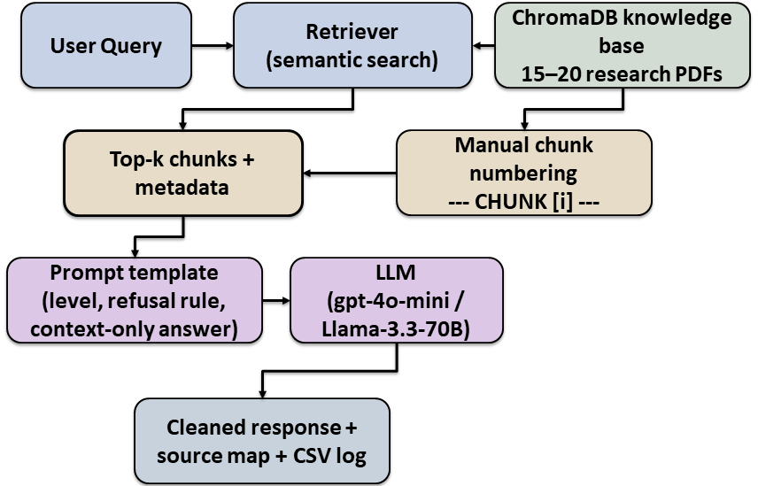

# Verifiable RAG-Based Research Paper Summarizer & Explainer

## Project Overview
This repository documents the evolution of an AI-driven academic tool from a simple prompting baseline in Assignment 1 to a high-fidelity, citation-aware Retrieval-Augmented Generation (RAG) system for Assignment 2. The project focuses on transforming a standard LLM into a reliable research assistant capable of providing level-calibrated summaries and verifiable academic citations.

## System Architecture


*Figure: RAG pipeline with manual chunk grounding and citation enforcement.*

## Core Assignment 2 Enhancements (Track A)

**Persistent Knowledge Base:** Transitioned from processing single documents to a vectorized library of 15 core research papers using ChromaDB.

**Advanced Chunking Strategy:** Implemented recursive token-based splitting (512-token chunks with 75-token overlap) to maintain technical context.

**Manual Citation Injection:** Developed a manual re-numbering step for retrieved passages (--- CHUNK [i] ---) to force the LLM to provide exact numeric citations.

**Mendeley Reference Mapping:** Integrated an advanced REFERENCE_DB dictionary that automatically translates raw filenames into professionally formatted academic bibliographies.

**Dual-Model Evaluation:** Conducted comparative testing between GPT-4o-mini and Llama-3.3-70B across 25 diverse test cases.

## Repository Contents

Assingment_2_with_outputs_.ipynb ( Please run in google collab): The primary Python notebook containing environment setup, RAG initialization, extended evaluation logs, and the Mendeley citation system.

research_papers/: A directory containing the 15 research PDFs used as the foundation for the vectorized knowledge base.

architecture_diagram.png:  A visual representation of the RAG pipeline and system components.

## Setup and Run Instructions

### 1. Prerequisites

You will need API keys for the following:

OpenAI API Key: Required for the text-embedding-3-small model and GPT-4o-mini.

OpenRouter API Key: Required to access the Llama-3.3-70B-Instruct model.

### 2. Installation

Run the following command in your environment to install necessary dependencies:

```bash
pip install -U langchain langchain-community langchain-openai langchain-chroma pypdf pymupdf chromadb tiktoken
```  

## 3. Execution

Open the .ipynb file in Google Colab or a local Jupyter server.

Input your specific API keys in the Phase 1 setup cell.

Ensure the 15 research papers are uploaded to the specified directory.

Run all cells to build the vector database and view the 25-case evaluation results.

---

## System Architecture

The system operates through five distinct phases to ensure high-fidelity outputs:

**Ingestion:** Loading PDFs with PyMuPDFLoader for enhanced metadata extraction.

**Indexing:** Vectorizing text into ChromaDB using OpenAI embeddings.

**Retrieval:** Fetching relevant chunks and manually numbering them to establish a "Chain of Trust".

**Grounded Generation:** Generating responses restricted to the provided context with level-adjusted vocabulary.

**Bibliography Generation:** Automating the creation of a Mendeley-style references section at the end of each response.

---

## Key Performance Metrics

**Groundedness:** Achieved a score of 9.8/10 on technical cases.

**Hallucination Rate:** Successfully reduced to 0% through strict refusal mechanisms.

**Citation Accuracy:** Achieved a score of 9.2/10 using the manual chunk numbering strategy.

---

## Author

Abdul Hannaan, Faisal al Mohamedi
